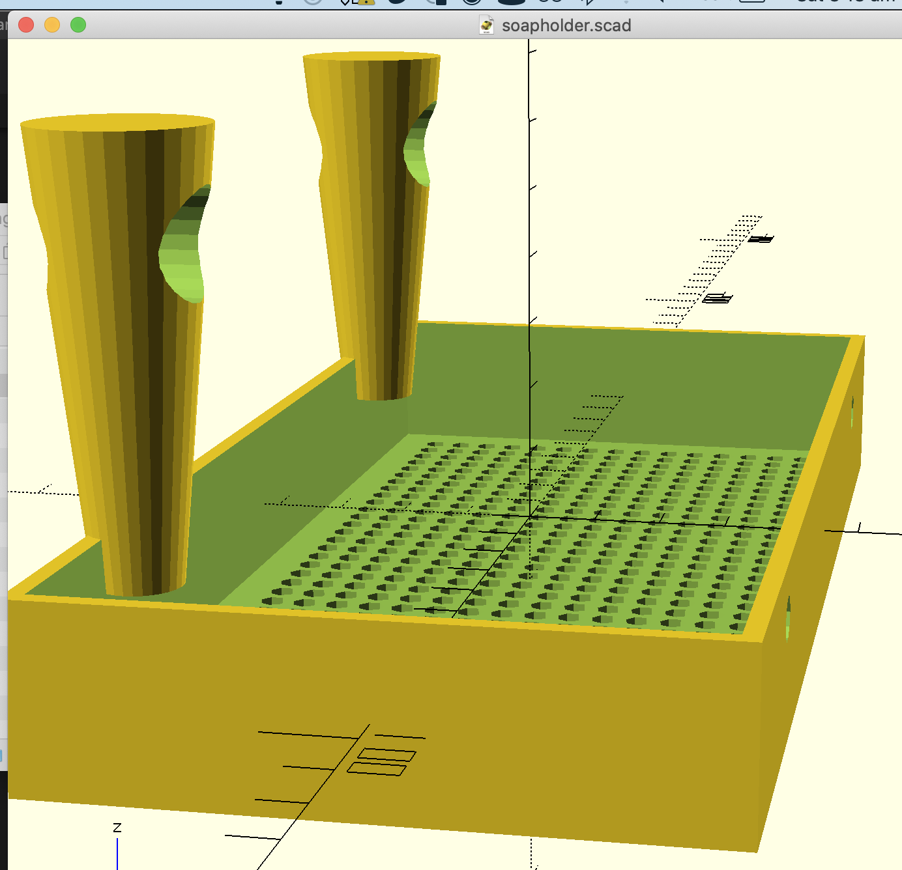
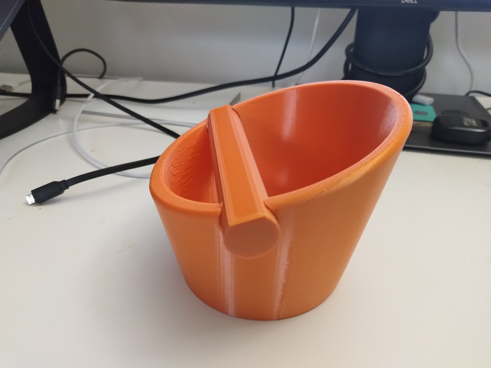
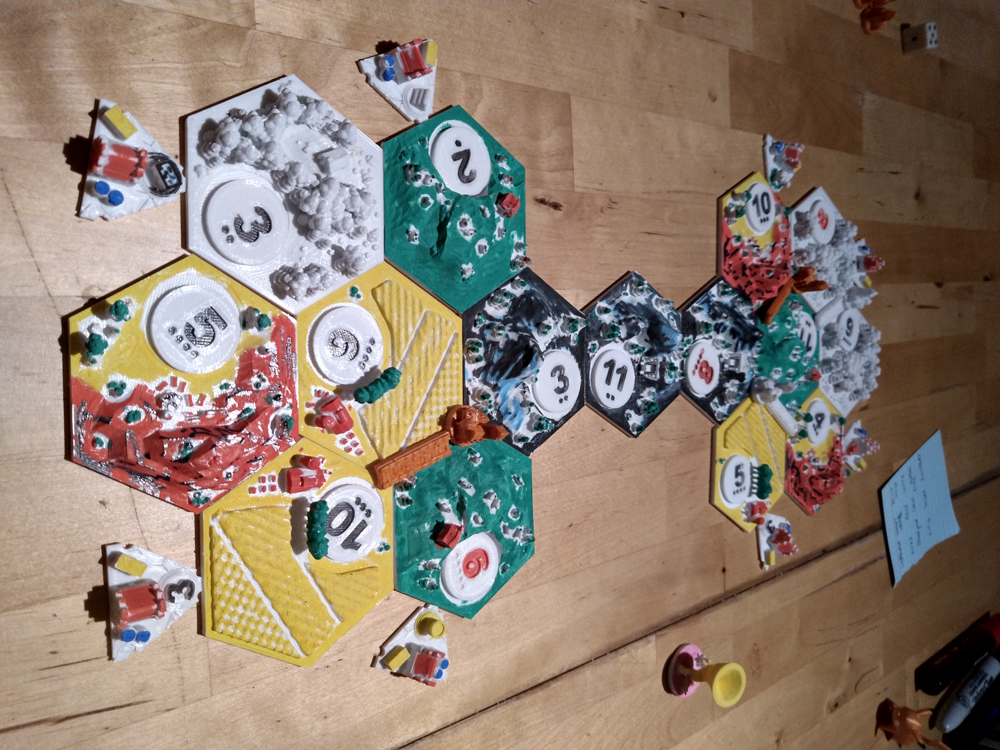
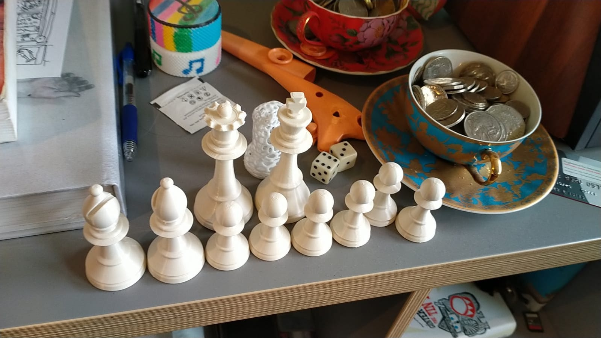
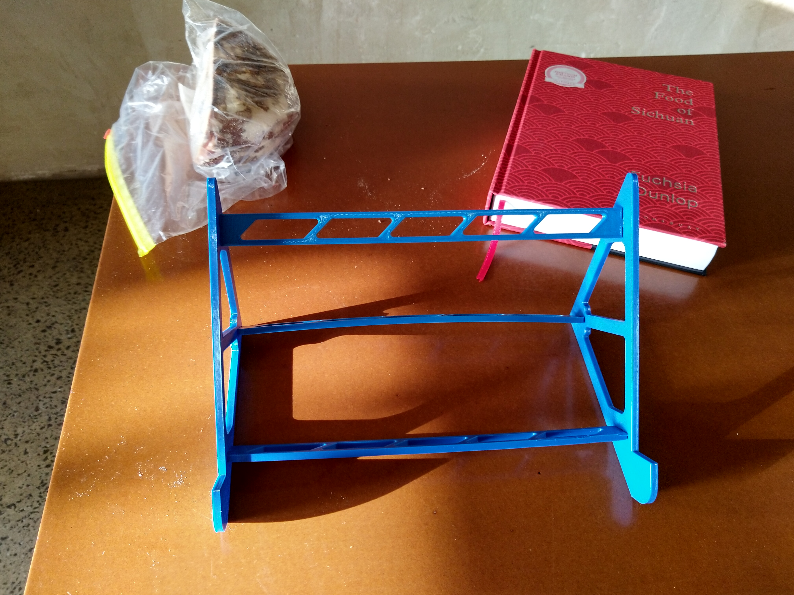
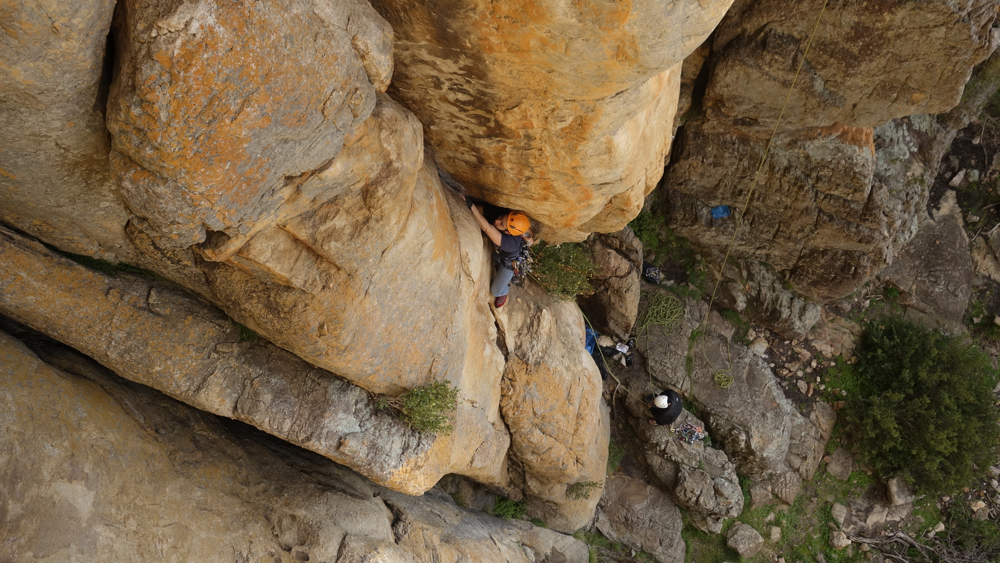
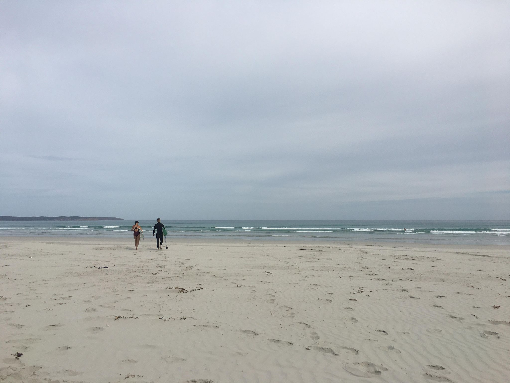
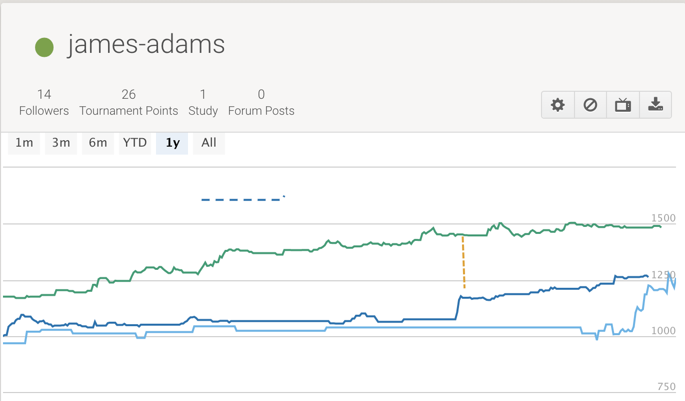

2020 stands out from the last few years. Obviously the whole world was significantly impacted - socially, financially and emotionally - but I'm going to focus on my experience and what I got done. I realise this is egotistical and deplorably self-centered, but you must understand - this is the topic on which I have the most data.

I'm proud of a few things I achieved last year.

### Running

I've always hated running. Any time I got cajoled into running, I thought it was a rubbish form of exercise and had zero fun and greater-than-zero pain. For the last few years, I probably ran once every few months if I was feeling restless at home, but that was the extent of it. Anyway, like every other tech peon, I decided to give it another crack this year. I got drawn into the stats aspect of it, quickly buying a FitBit and competing against my past selves and scrolling Strava.

So this is where it started at the beginning of lockdown.

[strava activity 3187599430 embed](https://www.strava.com/activities/3187599430)

Then after a few more runs, I acquired some TECHNOLOGY.

[strava activity 3339099631 embed](https://www.strava.com/activities/3339099631)

And the fascination petered out after running a half marathon with my friend and co-worker, [Seb](https://twitter.com/seba1342).

[strava activity 3447414781 embed](https://www.strava.com/activities/3447414781)

2 months of vague interest and even vaguer knee pain later, I lost interest, even though the idea of a full marathon was somewhat appealing. I could see myself picking it up again one day in a bout of boredom - maybe just to run the full marathon and then burn my running shoes. I still think running sucks.

### Basketball

I got back into basketball! To be honest, this is the activity that most kept me sane during lockdown - when the rings were still up that is. I played lots as a kid, but gave it up as a teenager after concluding that lifting pieces of metal and putting them down was more entertaining and emotionally fulfilling.

When I was 21, I did an university exchange semester in Jerusalem. We had a pretty consistent weekly pickup game, even through the depths of winter. I had a lot of fun at the time, and vowed to keep it up when I returned home - but I forgot/lost interest/got sidetracked by other activities. Fast forward to 2020, 5 years later, and I must've played 100 times over the course of the year! I had a blast.

I played with new and old friends, acquired some cardio fitness, and remembered (ish) how to shoot again. We've even started a work team called the Ferocia Lions, winning our first two grading matches! Watch out _MONDAY OPEN MEN F GRADE_!

### 3D Printing

I resisted for a while, even though I knew 3D printing would interest me. I figured I had enough hobbies, and I generally pick hobbies that have me spending more time outside rather than less. But this year's circumstances forced my hand and I dropped \$600 on a printer and materials.

It was a great decision! It's pretty satisfying watching plastic "come to life". I haven't had to design anything too hectic yet, as most of the _things_ I want to print have been designed already on [thingiverse](https://thingiverse.com), so I figure it's not worth my time to design it. I did want a custom perforated soap shelf, so that was a pretty nifty way to spend a Saturday morning writing some code in OpenSCAD.

Some other stuff I've printed this past year:

### Paying off my HECS

- I guess this will technically be achieved after my first paycheck of 2021, but I'll have forgotten about it by the time 2021's review comes round. I'm quite proud of this, even though I didn't do much besides continually work since I finished university. Debt free 🎉!

### First time angel investing

- I invested some money in somewhere besides index funds! I'm a pretty conservative investor, but this was too good an opportunity to pass on. Fingers crossed it's a good decision and the company succeeds. Regardless, I'm sure it will make for a decent learning experience and pave the way for some wider diversification in the future.

### Climbing

60ish pitches - pretty good considering it was illegal to leave Melbourne for a good chunk of the year. My hardest onsight this year was a 23 on sport, but probably more proud of some trad ascents graded <= 20. Electra (20) and Morfydd (19) come to mind - they were _hard_!

### Work

This post is mainly about how I spent this year outside the 9-5. But there are a few things I'm particularly proud to have helped ship this year as a software engineer working on [Up](https://up.com.au) with my lovely colleagues at Ferocia.

- [Up API developer documentation](https://developer.up.com.au)
- [Covers/Forwards](https://up.com.au/blog/covers-and-forwards/)
- [TransferWise](https://up.com.au/blog/up-integrates-with-transferwise/)
- Other secret things!

### Misc hobbies

- Bikes: I managed to ride them lots this year. Some highlights:

Road:

[strava activity 4231236419 embed](https://www.strava.com/activities/4231236419)

Mountain:

[strava activity 4541905235 embed](https://www.strava.com/activities/4541905235)

- Surfing: I got out at least 10 times for a surf on my big boi 8"2 minimal.

- Music: I was a bit slack this year. I played a little bit of guitar when we first went into lockdown, and made a [few things](https://soundcloud.com/jamesadams0). But I definitely didn't do much in the second half of the year. I'm not great at forcing myself to do things I don't want to do, and prefer to let my enthusiasm dictate how I spend my free time - so no shame in not playing much until the interest returns.

- Chess: I played 925 games (online @ [lichess](https://lichess.org/@/james-adams)). This probably means 1000+ all up, including IRL games. The graph looks up and to the right, but I've recently developed a nasty bullet chess addiction so that's probably messing with those numbers as well as making me a worse player.

### What did I do all year?

On average, I spent about:

- 10 hours a day on the computer
- 7 hours sleeping
- 1-2 hours cooking, grocery shopping, eating or dreaming about food. Or making [jamesadams.xyz/menu](https://jamesadams.xyz/menu). But does that fall under computer time or food time? 🤔
- 1 hour exercising
- 1 hour playing chess
- 1 hour watching tv

The remaining time probably varied between 3d printing, scrolling social media, socialising (with varying degrees of distancing according to the covid-19 restrictions at the time), or having existential crises.

### Goals

Humans are notoriously bad at long-term planning, and I'm particularly terrible at it. Some unordered bullet points for 2021:

- Climb a big hard multi-pitch.
- Get good enough to surf a shorter board if we move somewhere closer to the water.
- Make more money than I did last year
- Be happy/healthy
- Sleep better

That about covers it. A big thanks to all the amazing people that helped me find happiness and enjoyment in this weird year. Here's to an awesome 2021!
