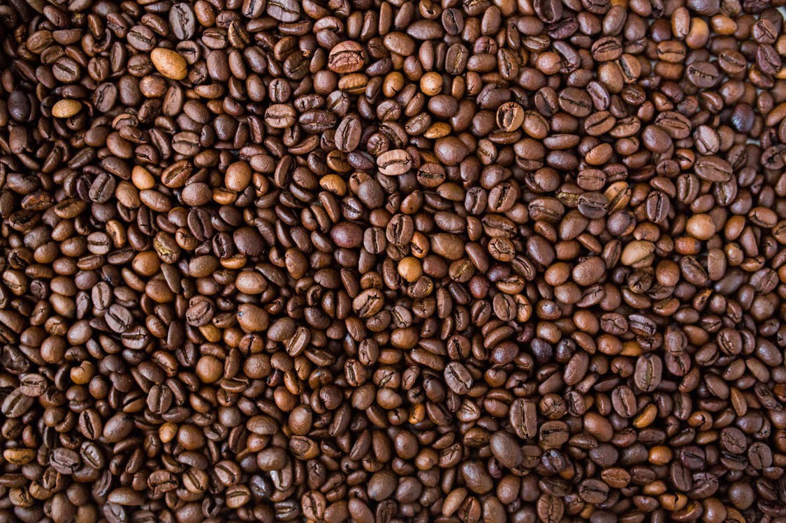

Originally posted [**here**](https://medium.com/@jamesadams0/decision-making-at-scale-ae227068f1e9) on 03/02/2018. It's unedited.

---

Ever since I was a kid, I’ve held pretty libertarian beliefs.

“Mum I’m a libertarian.” — James at 3 years old.

I hated being told what to do. And I never had much interest in convincing other humans to do my bidding.

Maybe it stems from a lack of faith in large corporate entities, governing bodies, or ‘grown-ups’. Or maybe I’m just a…rugged individualist. (Publisher's note: **This was meant to be sarcasm but pretty cringey to read in retrospect** )

However, something recently shook this long-held belief. Or rather, it took a shit on this pretty little libertarian paradise I’d fabricated in my head where humans behave nicely to themselves and each other, act responsibly, ethically, morally — and don’t trash the world.

Let’s construct a thought experiment together.

Beans for thought?

Company X has a decision to make, with two options available. The decision will directly impact some task that employees will often do. It could be washing hands or coffee preparation and consumption. Both options have the same economic feasibility and the same implementation cost, but they differ in that employees might have to do a little bit more work when performing that task. This could mean the difference between providing coffee capsules, or some other means of caffeinating your staff.

However, capsules have a higher environmental cost. This opens us up to the following question:

Does Company X have an ethical obligation to make the better decision?

Personally, **I think so**.

Let’s look at a few rationalizations for this position.

## Scale

This is the main factor that’s been bugging me. When a company makes a decision that affects the coffee consumption of 2000 people, some simple arithmetic can make things seem quite _concerning_.

2000 people \* 2 cups/day \* 5 days/week \* 46 working weeks = 920,000 cups of coffee/year.

This is ludicrous! A mid-sized company of 2000 people changes something about their coffee facilities, and they’re affecting almost a million cups of coffee per year.

If Company X decides to switch to say, Nespresso capsules, this means they’re making a decision that instantly means 920,000 capsules will be used.

Now, [**Nespresso**](https://www.nespresso.com/pro/au/en/pages/recycling-process?icid=B2B_Auen_Homepage_Universe_2017_02_Recycling_2) does offer a recycling facility. Good. But my basic understanding of the environmental impact still brings me to the conclusion that this is an immoral decision to make. [**A crazy amount of energy**](http://theconversation.com/the-trouble-with-aluminium-7245) is required to extract aluminium from bauxite (one of the principal ore sources) — and I’m highly skeptical that all that energy comes from renewable means.

The alternatives — an automatic coffee machine which grinds the beans for you, a separate grinder and espresso machine, or even a drip filter machine. None of these options call for more raw materials than just coffee and potentially some biodegradable filter paper.

“But what about the inconvenience?”

Whinge. Whinge whinge. Whinge whinge. Go make yourself a damn coffee. Spend the two minutes it takes to prepare it. You can’t possibly be that busy. And if you are — I assure you, you’re not productive. There are enough studies that suggest that taking a break or doing a habitual task could help you solve whatever problems you’re working on.

## Most people just don’t care enough.

I’m fortunate enough to have crossed paths with many smart people. Brilliant problem solvers, hotshot programmers, or socially switched on geniuses.

So many of them have the brain power to understand why something is bad for the world, and what extra little task they could do to reduce their impact.

But they don’t do it. Good luck convincing them otherwise.

The average human being, scrupulous or otherwise, doesn’t actually care about the environment. They won’t go out of their way to do the right thing. I’m vaguely switched on and I care about these things, but I’m still not a perfectly upstanding participant.

In its own right, this is enough of an argument for why these kinds of decisions have to be made en masse. You can’t give people a choice — they will, like water down a slope, just take the path of least resistance.

Think more carefully, more deliberately, if you have to make decisions that affect the footprint of more than just yourself.

I’m a firm believer in not being a useless consumer. Trying to reduce your plastic usage, not touching take-away coffee cups with a ten foot barge pole, maybe eating a little less meat. These are all good things, but ultimately, the choices you make in your personal life just don’t scale the same way that decision-making at the corporate/governmental level do. Something something, [**Corporate Social Responsibility**](https://en.wikipedia.org/wiki/Corporate_social_responsibility).😕
