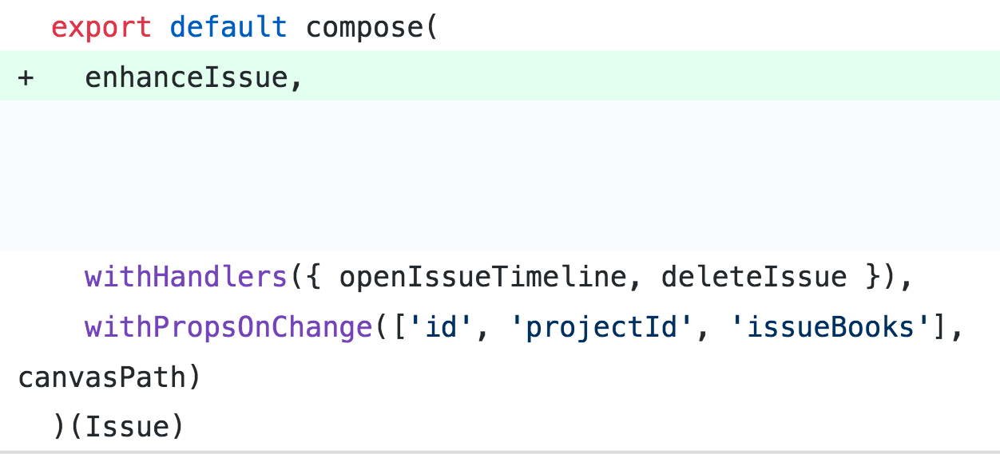

Originally posted [**here**](https://levelup.gitconnected.com/functional-react-is-it-possible-ceaf5ed91bfd) on 25/10/2018 with the title: _Functional React. Is it possible? Exploring functional programming techniques in React using Higher Order Components_. The article is presented unedited.

I found out about hooks shortly after publishing it. I've sinced moved on from the codebase talked about in this article - but it would be good to revisit these concepts and see how they hold up against hooks nowadays.

---


**Warning** — this post contains lots of **code**. If you’re triggered by seeing large blocks of javascript, please consult your loved ones, religious leaders and or a comfort puppy before proceeding.

Sorry for the clickbait-y title. Let me be more upfront with you.

**Yes. Yes it is.**

**And I’d like to show you how.** But first, a little background.

---

I started out with React in the second half of 2017. I was pretty green with web development, but something about React stuck with me — more so than any other framework.

I was able to learn bits and pieces of React at my previous job, but it was only proofs of concepts and new codebases that weren’t getting shipped anytime soon.

I was pretty hungry to work with React full time. Luckily, I found Drawboard and the rest is history.

A few weeks before starting, I was emailing with one of my then-future colleagues — the other front-end dev — and he gave me a list of technologies/frameworks that were being used on the web app.


Now initially, I’d never heard of [**recompose**](https://github.com/acdlite/recompose). I only knew vaguely what a HOC — _Higher Order Component_ — was. And functional programming was something whispered in the dark hallways, propounded by the gods — an unattainable paradigm that I knew nothing about.

So, before I started at Drawboard, I was writing pretty typical React code. It looked a little bit like this.


Since then, everything has changed. It’s very infrequent that I have to use the `class` keyword. Most of our view logic is composed of Higher Order Components and utility functions. Small building blocks that are easily grokked (understood) in isolation, but powerful and all-mighty upon composition.

<blockquote class="twitter-tweet"><p lang="en" dir="ltr">Have you tried <a href="https://t.co/TpmZKQ0QBO">https://t.co/TpmZKQ0QBO</a>?<br>We&#39;re down to 50 usages of the `class` keyword in a big codebase - it&#39;s abstracted a way a bit when necessary using HOCs, but it&#39;s super rare that you really need it.<br>Here&#39;s some code from a talk I gave recently:<a href="https://t.co/joeKbIA9Ru">https://t.co/joeKbIA9Ru</a> <a href="https://t.co/0EWrHH3fJB">pic.twitter.com/0EWrHH3fJB</a></p>&mdash; James Adams (@jamesadams0) <a href="https://twitter.com/jamesadams0/status/1050569372882722818?ref_src=twsrc%5Etfw">October 12, 2018</a></blockquote> <script async src="https://platform.twitter.com/widgets.js" charset="utf-8"></script>

---

Before we dive into the magnificent rabbit-hole that is writing functional React — let’s start with a few explanations/definitions.

## Higher Order

The _order_ of a function refers to how deep it is. Your typical function is single order. Upon execution — with some stuff (arguments) or otherwise — it does a thing, and then finishes execution (by returning some stuff or nothing).

A higher order function behaves on a **grander scale**. It has loftier aspirations.

### A higher order function either takes a function as an argument or returns a function. Or both.


But this is too general. We’re talking React!

Hang on a second. Isn’t a component just an abstraction from a function?

<p align="center">
  
</p>

This naturally leads us to the following:


It’s okay if this isn’t crystal clear yet. But persist, and I assure you you’ll be using higher order functions and components all over the place once you can grasp their **POWER**.

If you’ve jumped on the React/Redux bandwagon anytime in the last couple years — you’ve probably used higher order components without even realising it.

Here’s a common one:


`connect` takes some arguments — `mapState` and `mapDispatch` — and spits out a higher order component. This HOC takes your `TodoList` component, and spits out a new, enhanced component. In this sense, `connect` behaves like a HOC factory.

Just to really send it home:

### Generally when we talk about a Higher Order Component (HOC), it is a thing that takes a component and spits out another component. A new, enhanced component.

Enough talk! Let’s take a look at the same component written in two different styles.

<p align="center">
  
</p>

Here is our `Farm` Component, written as a class.

```js
//------------------Written as a class---------------------//
class Farm extends React.Component {
  constructor(props) {
    super(props)
    this.state = {
      tools: ["hammer", "scythe", "sickle"],
    }
  }

  componentDidMount() {
    fetch("/tools")
      .then(({ body: { tools } }) => this.setState(tools))
      .catch(err =>
        console.log("Oh no, your tools got lost. Here's why: ", err)
      )
  }

  shouldComponentUpdate(nextProps, nextState) {
    return nextState.tools !== this.state.tools
  }

  render() {
    const { tools } = this.state
    const { someProp, anotherProp } = this.props
    if (!(tools && tools.length)) {
      return null
    }
    return (
      <div>
        Here are all the tools in the farm:
        <ul>
          {tools.map((tool, index) => (
            <li key={index}> {tool} </li>
          ))}
        </ul>
        {someProp} - {anotherProp}
      </div>
    )
  }
}
```

I’ve exaggerated a bit to prove a point — how often are you _actually_ implementing `shouldComponentUpdate` ?— but otherwise it’s a pretty typical component.

And this is the same component, written functionally. Note that I use some helpers from the aforementioned library, `recompose`. I’ll explain exactly how recompose works later on.

```js
import branch from "recompose/branch"
import withState from "recompose/withState"
import renderNothing from "recompose/renderNothing"
import onlyUpdateForKeys from "recompose/onlyUpdateForKeys"

import lifecycle from "out-of-scope-for-this-article-but-serves-same-purpose-as-recompose-lifecycle"

// And now the exact same thing, written functionally.
//---------------------------------------------------------------//
// Only the 'view' logic.
const BaseFarm = ({ someProp, anotherProp, tools }) => (
  <div>
    Here are all the tools in the farm:
    <ul>
      {tools.map((tool, index) => (
        <li key={index}> {tool} </li>
      ))}
    </ul>
    {someProp} - {anotherProp}
  </div>
)
// All the 'other' stuff.
const didMount = ({ setTools }) =>
  fetch("/tools")
    .then(({ body: { tools } }) => setTools(tools))
    .catch(err => console.log("Oh no, your tools got lost. Here's why: ", err))

const shouldNotRender = ({ tools }) => !(tools && tools.length)

const Farm = withState("tools", "setTools", ["hammer", "scythe", "sickle"])(
  // N.B: lifecycle isn't the one from recompose
  lifecycle({ didMount })(
    branch(
      shouldNotRender,
      renderNothing
    )(onlyUpdateForKeys(["tools"])(BaseFarm))
  )
)
```

Or even better, using `recompose/compose`:

```js
// Or better:

// same imports as before plus...

import compose from "recompose/compose"

const Farm = compose(
  withState("tools", "setTools", ["hammer", "scythe", "sickle"]),
  lifecycle({ didMount }),
  branch(shouldNotRender, renderNothing),
  onlyUpdateForKeys(["tools"])
)(BaseFarm)

// Alternatively.
const enhance = compose(
  withState("tools", "setTools", ["hammer", "scythe", "sickle"]),
  lifecycle({ didMount }),
  branch(shouldNotRender, renderNothing),
  onlyUpdateForKeys(["tools"])
)
// enhance is a HOC, composed of a few other HOCs.

// It takes a component (BaseFarm) and returns Farm.
const Farm = enhance(({ someProp, anotherProp, tools }) => (
  <div>
    Here are all the tools in the farm:
    <ul>
      {tools.map((tool, index) => (
        <li key={index}> {tool} </li>
      ))}
    </ul>
    {someProp} - {anotherProp}
  </div>
))
```

At first glance, the two different styles can seem extremely different — but they really do the same thing.

Let’s say you have a `Workshop` component. And it’s used on a separate view or even in an entirely different application. You’d be able to ‘steal’ all the business logic from the `Farm` component— you could pick and choose the smaller HOCs or grab the composed `enhance` HOC — without even breaking a sweat.

How would you do this in typical, class-based components? You can’t. This is what makes writing React functionally with HOCs so damn awesome.

### Introducing recompose:

#### _“Recompose is a react utility belt for function components and higher-order components. Think of it like lodash for React.”_

That’s taken directly from the `README`. Simply put, it’s a useful collection of HOCs and helpers that blaze the trail for you to write high-quality, functional React code.

Let’s deep dive into some `recompose` code. I promise it’s quite approachable — it isn’t doing anything mega funky under the hood.

### Recompose/mapProps (Edited for brevity. [**original**](https://github.com/acdlite/recompose/blob/master/src/packages/recompose/mapProps.js))

```js
import { createFactory } from "react"

const mapProps = propsMapper => BaseComponent => {
  const factory = createFactory(BaseComponent)
  return props => factory(propsMapper(props))
}
```

You can use `mapProps` to [**map**](<https://en.wikipedia.org/wiki/Map_(higher-order_function)>) the props coming in to your component before they get there. Let’s say our props look like this initially:

```js
{routerProps: {location, query, hash}, tools, ...props}
```

But your component doesn’t care where the `routerProps` come from — it just needs them as they are. An example `propsMapper` could be:

```js
const propsMapper = ({ routerProps, ...props }) => ({
  ...routerProps,
  ...props,
})
```

Nothing crazy, it just spreads the `routerProps`.

So to use `mapProps` you’d do something like this:

```js
const myMapProps = mapProps(propsMapper)
const myEnhancedComponent = mapProps(myBaseComponent)
// alternatively, all in one go:
const myEnhancedComponent = mapProps(propsMapper)(myBaseComponent)
```

I think you’re starting to get the hang of this whole _higher order_ thing.

Now — recompose has some really useful HOCs. But they’re basic, general and won’t solve every problem specific to your application. No worries —you can and should roll your own Higher Order Components to suit your needs. We have hundreds in our codebase.

Here is an example of an HOC that I wrote called `withStateOfTypeSet`.

It’s useful for avoiding reimplementation of the same logic across many components that have to store some local state which belongs in a Set. For those unfamiliar with how Sets behave in JS —check out the [**MDN docs**](https://developer.mozilla.org/en-US/docs/Web/JavaScript/Reference/Global_Objects/Set).

### withStateOfTypeSet

```js
import withState from "recompose/withState"
import compose from "recompose/compose"
import withHandlers from "recompose/withHandlers"

import stringCapitalize from "somewhere"

const addToSetFactory = (stateName, stateUpdaterName) => props => item =>
  props[stateUpdaterName](new Set(props[stateName]).add(item))

const removeFromSetFactory = (stateName, stateUpdaterName) => props => item =>
  props[stateName].delete(item) &&
  props[stateUpdaterName](new Set(props[stateName]))

const defaultInitialState = () => new Set()

/**
 * Puts a field in the state named stateName, and provides addToStateName
 * and removeFromStateName methods to add/remove from the set.
 *
 * eg: stateName=selectedTags, stateUpdaterName=setSelectedTags
 *
 * The following props will get added:
 *
 * selectedTags, setSelectedTags, addToSelectedTags, removeFromSelectedTags
 *
 */

export default (stateName, stateUpdaterName, initialState) =>
  compose(
    withState(stateName, stateUpdaterName, initialState || defaultInitialState),
    withHandlers({
      ["addTo" + stringCapitalize(stateName)]: addToSetFactory(
        stateName,
        stateUpdaterName
      ),
      ["removeFrom" + stringCapitalize(stateName)]: removeFromSetFactory(
        stateName,
        stateUpdaterName
      ),
    })
  )
```

I’m hoping the code is pretty self-documenting. It’s a _nifty_ HOC which abstracts away some of the funky stuff you have to do when initialising or adding/removing from a `Set` . The only thing I should really explain here is that `recompose/withHandlers` adds functions to your component that are called with the most up to date props. [**Check it out**](https://github.com/acdlite/recompose/blob/master/src/packages/recompose/withHandlers.js).

#### The extent to which you can compose HOCs is endless. These are the building blocks with which your application is built.

So far — I’ve only showed learning examples. Whilst cool — they don’t really show what functional React can look like when taken to the **extreme**.

<p align="center">
  
</p>

Below is the default export for one of our biggest components. It has a lot of behaviour and is one of the uglier of the bunch. But all of its functionality is composed of many small buildings blocks. All the `handlers` are tiny functions. And the view logic is a stateless functional component that does nothing besides declare how the component should _look_.


Now — I’ve written a whole chunk about the _what_. But let’s jump to the extensive and overwhelmingly positive _why_.

I won’t cover the benefits of writing functional code in general — of which there are many — as this article would turn into a sermon. But it’s certainly within scope to explore some of the React-specific upsides.

### Intra-component code reuse is significantly more feasible

You can now share code between components without copy-pasting. This is probably the biggest win. Your codebase will be more succinct, you’ll only have to change business logic in one place rather than 10, and code will be infinitely more readable. Plus, it’s so much easier for new developers to grok smaller functions and components than to try and grok 500 line monsters.


The effect is compounding once your whole codebase follows the same patterns. Because as time progresses — as it inevitably does — you’ll find that you’ve already done this new thing that you’re trying to build. And you’ve written 90% of the HOCs you need! So it’s just plug and play and then you can ship! 🚢 (Kidding, but optimistic delusions aside, sometimes it actually feels like that.)

Often, components you end up crafting are composed of 1-many HOCs wrapping some generic component such as a modal, a button, or a link.

---

## How the benefits extend to React Native

Earlier in the year I talked about my [**experiences**](/words/react-native) integrating React Native into an existing iOS application. I also spoke about it at [**MelbJS**](http://melbjs.com/) — the slides are [**here**](/talks). It’s something I’m **really** excited about. And one thing that always stands out to me as revolutionary is the ability to share code between the two applications.

I’ve set up the web repo as a submodule in the iOS project, so any code that we write for the web can easily be used in the iOS application. There are a lot of cool parts to this — the iOS application is even ‘repping’ the same data layer as the web! — and if you write your React like we do, then you can share component business logic cross-platform.

Let’s take a real world example of this. A few months ago we built out issue management in our web application. Think of it as _Jira_ for architects/engineers to raise issues on drawings.

Isn’t there some rule that states that every software project that grows _sufficiently large_ will eventually build its own implementation of _Jira_? 🤔

Anyway, the export for one of the core components, `Issue` , looked a little bit like this:


Notice the red. We needed this same logic when I began building the same feature set in the iOS application in React Native. So a natural refactor followed:




And then I could use this same HOC to wire up the React Native `Issue` component!

Again, not a crazy complicated example, but I hope you can see how these ideas can extend to entire features, codebases or even cross project like in this instance. I didn’t even have to go looking for this example! When I gave the talk that morphed into this write-up, I’d just finished building this feature — it’s pretty cool how easy it was to find examples of why functional programming in React is so damn awesome, just from my day-to-day work.

Our ability to experiment so successfully/quickly with React Native was entirely driven by our web codebase being structured in this manner.

You can actually go one step further and share view logic as well using [`react-native-web`](https://github.com/necolas/react-native-web) or [`react-primitives`](https://github.com/lelandrichardson/react-primitives) but I’ve yet to bring these ideas into our applications.

---

## Potential Downsides

I’m not a massive fan of selling some methodology so enthusiastically whilst at the same time, entirely neglecting to cover any pitfalls.

Let’s explore a few downsides of writing all your code like this.

- Performance characteristics are a bit of a grey area. I denoted this section as _potential_ downsides because I’m really not sure about this one. I’m not saying that React code written functionally is less performant than functionally identical ‘traditional’ React view logic — but I’ve never seen any experiments and I’m yet to delve into it. This is because so far, we haven’t had any problems with jank on the Bullclip web app. I’d be very interested to hear if anyone has looked into this — especially with the profiling capabilities of the new [**React dev tools profiler**](https://reactjs.org/docs/optimizing-performance.html#profiling-components-with-the-devtools-profiler)— so please get in touch if you do so!

- Sometimes there are certain things that you either can’t do, or are made harder than they should be using this pattern. Using refs is doable but less intuitive. If you’re hooking into the lifecycle and doing very complex stuff — you might find it easier to use a class. But you can treat these things similarly to how you should treat impure, side-effecty code in a predominately functional codebase. **Isolate it, acknowledge that you’re using some impure code, use it, and move on**.

- React dev tools go deep. Exploring the component tree is significantly more difficult (but far from impossible) because each HOC adds another component into the tree. Funnily enough I don’t often need to do this because one of the upsides of writing code like this means I usually can work out pretty quickly where the bug is.


But, you could see this as a plus if you appreciate the ability to see which HOC added which props into the chain.

## Exploring the alternatives

- Render props. If I didn’t have access to HOCs (cut to an apocalyptic, dystopian future where functions max out at single order) — I like this pattern the most. It’s out of scope for this article, but check it out at the official react [**docs**](https://reactjs.org/docs/render-props.html).

- Collections of pure functions that you hook into from class components? (A bit ugly but still allows code reuse. Dealing with `this` could be a bit yuck though.)

- Prototypal/Class based (_extends_) inheritance everywhere? _**Please** don’t do this_.

- Copy/Paste code everywhere? (I’m joking. Stahp, pls.)…(I’m joking. Stahp, pls.)

---

I hope I’ve given a tasty enough selection of what’s possible when you write React functionally. And maybe a little bit of insight into the journey I’ve undertaken in the last year or so.

I’m a big fan of putting my work out in public. It could save someone a lot of time — or give another person an opportunity to explain to me why my views are wrong. Please get in touch if you have any questions/want to tell me why you think this is bad, why I’m wrong or that I smell. I promise not to yell functional programming terms at you.

I’ll just put all that angst into a [_curry_](https://en.wikipedia.org/wiki/Currying).

Resources:

- https://reactjs.org/docs/higher-order-components.html
- https://drboolean.gitbooks.io/mostly-adequate-guide-old/content/

The content for this article was fuelled by a talk I gave at the August React Meetup in Melbourne. You can find the slides [here](/talks).
