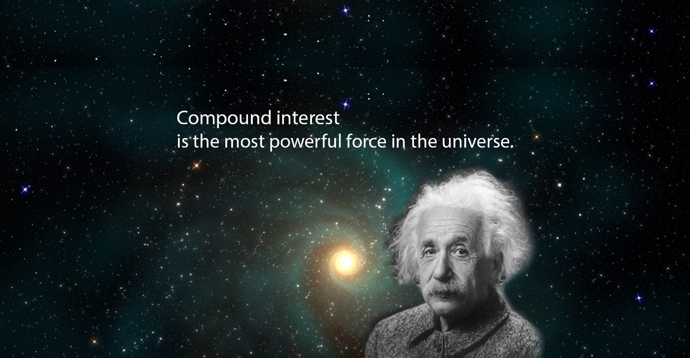

Originally posted [**here**](https://medium.com/@jamesadams0/what-to-do-with-your-money-4ae536f504e1) on 29/01/2018. It's unedited.

---

[**Last post**](/words/some_ramblings_on_money), I touched on my personal relationship with money. I talked briefly, optimistically, on the concepts of frugality and moustachianism.

Moustachianism: Financial Freedom through badassity.

In this instance of my ramblings— as promised — I want to delve into what to do with your money once you’re not spending it all.

Conventional wisdom tells you to buy a house, but it could take you years to accumulate enough money for a deposit — especially in a city like Melbourne, where [**1 in 3 suburbs have a median house price of over \$1 million.**](http://www.abc.net.au/news/2017-12-10/one-in-three-melbourne-suburbs-million-dollar-median-house-price/9243408)

Next up, people will misinform you to go buy a few blue chip stocks, or worse, they’ll tell you about this great new small company whose shares are currently valued at 3.5c, but they’ll totally hit a dollar by this time next year.

Or even better, they’ll invite you to invest in their shitty startup idea!

These ideas all suck as suggestions on where to put the bulk of your earnings.

Choosing a few stocks and holding steady means you’re over-investing in a small handful of companies.

Startups and speculating on more volatile securities = gambling. And don’t even get me started on ‘investing’ some number greater than 0.5% of your monthly salary in bitcoin. (Spoiler alert: This isn’t investing.)

Surprisingly, most people don’t know what index funds are. Even though they are the most suitable long term investment for 99% of people. (Disclaimer: I’m not a financial adviser — so take my advice with a few grains of salt.)

Simply put, index funds work as follows: You give them your money, either directly or via purchasing ETFs (like shares) — and their job is to track the market, maintaining a balanced collection of shares, weighted by market cap. You can buy in funds that track one or more markets — and you can diversify by investing in more than one fund.

They are a long term investment.
The crazy thing is — you don’t need to know any of this. If you’re working in Australia, you already invest in index funds in the form of superannuation, and 99% of people have no idea how it works. But it does. The trick is to go beyond super, and put away half of your paycheck into index funds for your entire working career. And you’ll end up rich. By doing nothing. This is called passive investing — and it’s incredibly powerful.

Einstein probably didn’t say this. But let’s call it…paraphrasing.

The market goes up and down, but on average, for the last 100 years, you could safely double your money or more, every 7-10 years. Here’s the Dow Jones for instance: http://www.macrotrends.net/1319/dow-jones-100-year-historical-chart.

$1 dollar now equaling $2 in 10 years, $4 in 20 years, $8 in 30 years. Doesn’t seem like much, right?

Let’s look at the median Australian salary of $80,000. You have the option of spending or saving each dollar that you earn. But that means, in 20 years, you’d have to be earning $320,000 to match the value of the dollars you earn now. Do you see yourself being able to quadruple your salary in the next 20 years? If you answer yes — great, share your secrets with us. But more likely than not, you won’t be earning such a ludicrous sum. However, you could achieve the same effect by putting some money away now.

Hopefully I’ve triggered some sort of curiosity — maybe you’re even trying to calculate how much money you’ll have in **x** years of putting away **z** dollars.
Let me do the maths for you.

[**Early Retirement Calculator**](https://networthify.com/calculator/earlyretirement?income=80000&initialBalance=0&expenses=40000&annualPct=5&withdrawalRate=4)

Compound interest is powerful but takes a long time. To retire in 5 or 10 years the most important number is not your…
networthify.com
So, starting from nothing, you could retire in 16 years. This doesn’t take into account super (+), savings (+), or inheritance (+). Or debt (-). Or Melbourne’s ludicrous property market (- -).

This form of investing can be attributed to [**John C. Bogle**](https://en.wikipedia.org/wiki/John_C._Bogle#Investment_philosophy), the founder of Vanguard — one of the largest providers of funds in the world. (They have \$4.5 trillion in assets under their management.)

I’d highly recommend getting started with [**The Bogleheads’ Guide to Investing**](https://www.amazon.com/gp/product/1118921283/ref=as_li_tl?ie=UTF8&camp=1789&creative=9325&creativeASIN=1118921283&linkCode=as2&tag=jamesadams0-20&linkId=95f0a11b485dae3d02538913c89d272c%22%3EThe%20Bogleheads%27%20Guide%20to%20Investing%3C/a%3E%3Cimg%20src=%22//ir-na.amazon-adsystem.com/e/ir?t=jamesadams0-20&l=am2&o=1&a=1118921283). It’s a little bit more tailored towards the US investor, but the lessons can be applied anywhere. Especially given we can invest in Vanguard in Australia really easily through ETFs. [**Check it out**](https://www.vanguardinvestments.com.au/retail/ret/articles/insights/research-commentary/etfs/etfs-how-to-get-started.jsp?lang=en).

I honestly believe that this is what 99% of people should do with most of their money. Or you could just put it in bitcoin…(/sarcasm, please don’t do that.)

Thanks for taking the time to read this article! Feel free to leave a comment if you agree or disagree!
