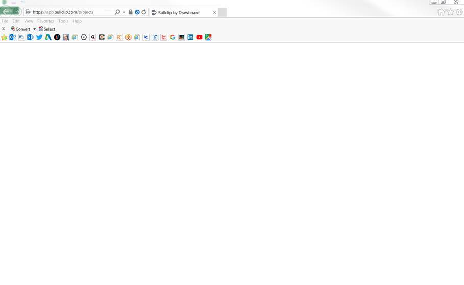
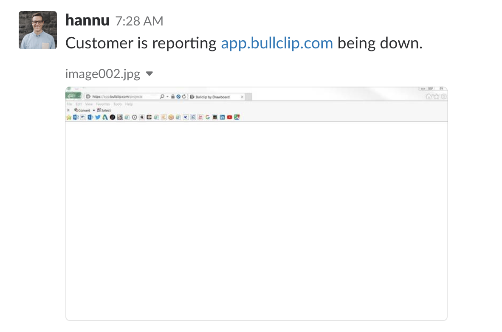
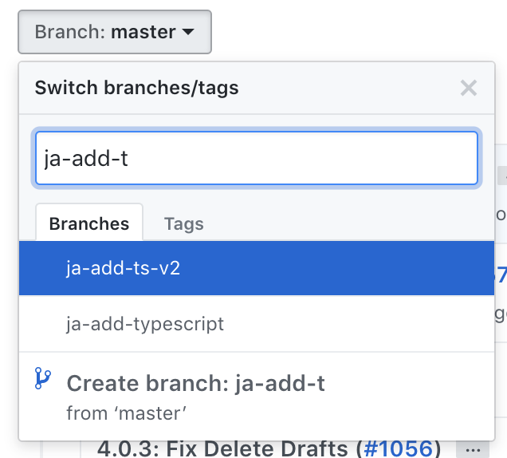
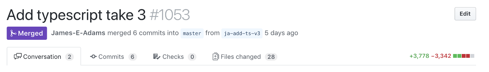
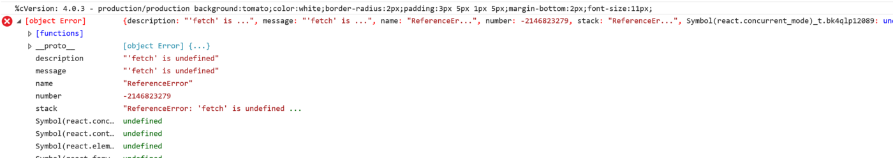
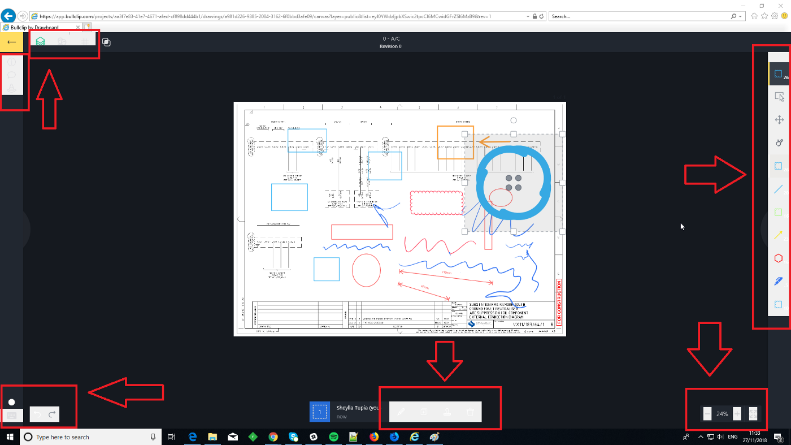
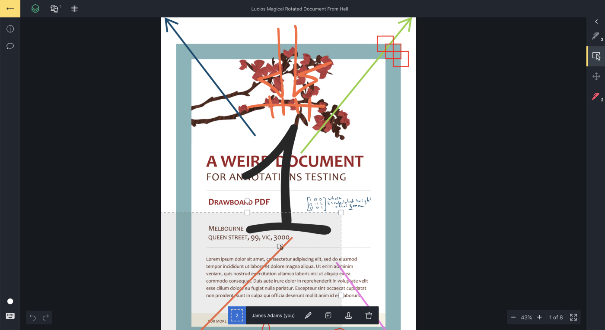
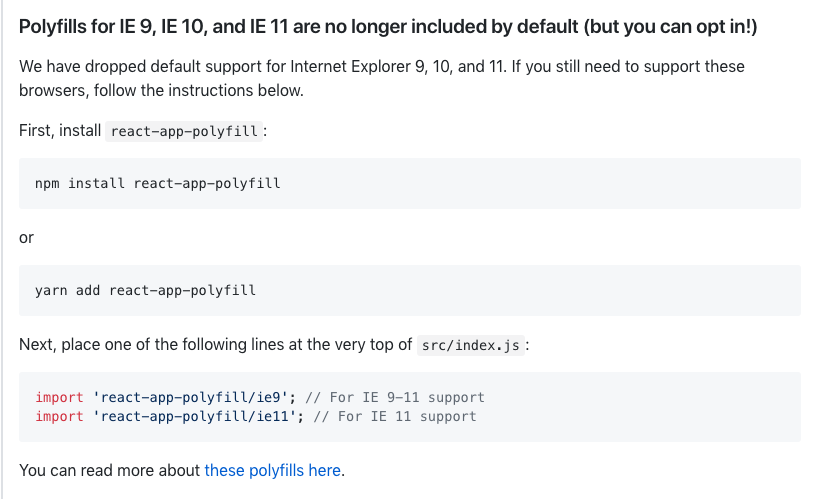
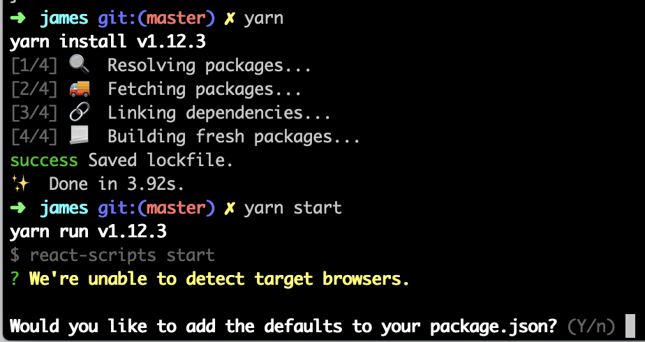
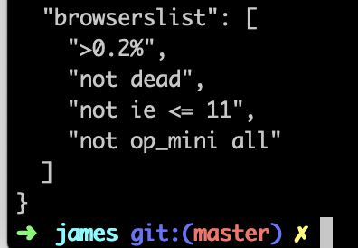

Originally posted [**here**](https://levelup.gitconnected.com/i-broke-ie-a-post-mortem-6201c4861d64) on 29/11/2018., while I was working at Drawboard. I had a giggle at the footer, so I left it in.

---



<p align="center">
  This is how my day started.
</p>

## TL;DR: Read release notes. And check your create-react-app in Internet Explorer!

Things were looking good as I got out of bed that day. The weather was doing the Melbourne thing — the sun was nowhere to be seen — but I’d slept well and had no tangible complaints. As I do most mornings, I made some coffee and jumped on Slack. I meandered through my unread messages — news articles, some banter, maybe a few book recommendations. Until this doozie:



Take a look in the top left corner of that screenshot and you’ll see this:


## Let’s be honest. Every web dev has broken IE at least once in their career.

However, it’s not super often that you’re responsible for the app being completely borked in production. I’d like to explore the chain of events that lead to this happening — and potentially delve into what we can do to prevent this kind of thing from reoffending in the future.

For the last few months, I’ve been pushing for us to use TypeScript on our front-end.

TypeScript is a strongly typed superset of JavaScript that compiles down to plain JavaScript. [**https://www.typescriptlang.org/**](https://www.typescriptlang.org/)

There hasn’t been any pushback (which is great). Everyone’s on board — there’s only two of us on the front end though, so I already had 50% of the vote. Yay for quasi-dictatorships!

But every app is beautiful in its own way, so it required a bit of fiddling to get working.



As you can see above — it took me a few times to integrate it to completion without getting distracted by more pressing priorities. 3 attempts in total.

Given we’re a CRA — [**Create React App**](https://github.com/facebook/create-react-app) — it initially meant using [**create-react-app-typescript**](https://github.com/wmonk/create-react-app-typescript). However, before that attempt was merged and production ready, CRA v2 shipped, adding TS support. 🎉

_Or so I thought._

Anyway, last week I was feeling pretty good with what I had setup with CRA v2 to configure TypeScript in our codebase. I had added some examples, made sure all the build/test stages work, and I had even added a storybook in a previous PR that supported TS!



The diff wasn’t too crazy, and around half those changes come from the `yarn.lock` file.

In this PR, I bumped `react-scripts` to `^2.0.0` to get support for TS out of the box. Nothing seemed to break so I didn’t spend too much time investigating the _what ifs_.

## Red flag #1. 🚩

---

This was merged, however I didn’t release anything because it wouldn’t have any visible effect in production.

Eventually, we merged something into `master` that warranted shipping.

This release dropped ~24 hours before Hannu sent that message on slack. A pretty decent amount of time for IE to be broken in production. Not good enough, one might say.

This is what we found on initial diagnosis:



What?!? How are we missing the **polyfill** for `fetch`?!?!

_A polyfill, or polyfiller, is a piece of code (or plugin) that provides the technology that you, the developer, expect the browser to provide natively. Flattening the API landscape if you will. Source: [https://remysharp.com/2010/10/08/what-is-a-polyfill](https://remysharp.com/2010/10/08/what-is-a-polyfill)_

A quick explore through the git tree branded the commit merging TS support to be the offending gremlin.

To get this fixed in production ASAP, I quickly added the most popular cross-browser polyfill for fetch, [**whatwg-fetch**](https://github.com/github/fetch), confirmed it fixed **everything**, and shipped.

It didn’t fix **everything**.

## The story in emojis: 🚢 ->🎉 -> ⏲️ ->😭

2 hours later, this was the next issue reported. Luckily, it was only reported internally by our super awesome QA team.



Woahhhhh. Wild. Those are some funky design decisions. It’s eclectic. It’s avant-garde.

It’s really, really **ugly**.

This is what it should look like in a modern browser.



So what could be causing the CSS to break in IE? And why hadn’t I noticed it on my run through the app before I shipped?

A quick muck around in the dev tools showed that a CSS property that should be `background-color: transparent` had somehow been transpiled into `background-color: initial`. What the hell, build tools? You’re meant to love me, not spite me!

Diffing with the compiled CSS prior to the offending commit resulted in the following:

```css
-------
<   -webkit-box-sizing: content-box;
<   box-sizing: content-box;
<   background-color: transparent;
---
+++++++
>   box-sizing: initial;
>   background-color: initial;
```

Clearly something had changed from `react-scripts` `1.x` -> `2.x` .

But it was only in the compiled CSS. The CSS was **100% okay** when served from the dev server.

I’ll save you the 20 minutes of googling, and tell you what I should have done from the very start. Before I could even consider bumping `react-scripts` — before the thought had even teetered on the very brink of entering my mind — I should have read the release notes. It’s a breaking change, after all. [**SemVer**](https://semver.org/) exists for a reason. They can do whatever they want in a major version update, and the _release police_ — 🚓 — can’t do a damn thing.

## Red flag #2 🚩

---

Well, here’s a snippet from the release notes for the first offical `v2` release of `react-scripts`:



So this explains why we had lost the `fetch` polyfill. I quickly removed the `whatwg-fetch` I had added earlier, and switched it out for the recommended `react-app-polyfill` (which includes `whatwg-fetch` ).

But I was still at a loss for what had happened to the CSS tooling. Again, I’ll save you the 20 minutes of manual web scraping. `react-scripts 2.x` added PostCSS and AutoPrefixer. Relevant link: [**https://facebook.github.io/create-react-app/docs/post-processing-css**](https://facebook.github.io/create-react-app/docs/post-processing-css).

This relies on a `browersList` key in your `package.json` .

Relevant docs: [**https://github.com/browserslist/browserslist#readme**](https://github.com/browserslist/browserslist#readme)

If only I had been less careless when I ran `yarn` start for the first time:



## Red Flag #3 🚩

---

But one might ask, what are the default browsers? 🎩



Woops.

This is easily rectified by removing the line `not ie<= 11` . With that change, the compiled CSS was now correct and functional for IE11 (as well as all other modern browsers). One more PR, one more merge. Another run through CI and IE was now functioning…as best as it can.


## Moving forward

What can we do better in the future to prevent things like this happening in the future?

- Read release notes before bumping major version. Hell, read a damn dictionary, go play ping pong, eat a sandwich. A bit more deliberateness and presence should be employed before merging things that could 100% break your app.

- Cross browser testing. [**Coming soon to Cypress (woot)**](https://github.com/cypress-io/cypress/issues/310#issuecomment-434150624). If we had a single test running in CI in IE, then this could have been prevented. But the options are a bit slim at the moment, so it would have a high cost to set up.

- Tangential: [**https://github.com/greenkeeperio/greenkeeper**](https://github.com/greenkeeperio/greenkeeper) I wonder if this would have made us fail faster…

- Could there be some way to automate/make it harder to bump certain dependencies? As a CI guard, you could parse the `package.json` and confirm that updates to particular dependencies were deliberate. Not sure if this would be too much red tape.

- Got any other suggestions? Comment below!

Summing up — this was a major major bug. Fortunately the resolution process was less than 4 hours from when I nearly spit out my coffee in surprise, to our app being usable again.

I question whether this was the right decision for the create-react-app maintainers to make. I understand that removing support for IE11 and non-modern browsers reduces the size of the bundled CSS and JS. But that behaviour could have easily been opt-in, rather than forced automatic opting out when the previous status-quo was to support IE11.

I’m James — My daytime activities involve doing cool web stuff ~~for Drawboard~~, climbing rocks, and drinking coffee. When the planets are travelling at the right speeds and temperatures, I write about the Web/JS/React/my feelings. Follow me on [**twitter**](https://twitter.com/@jamesadams0) for shorter form rants that were formerly limited to 140 chars!
