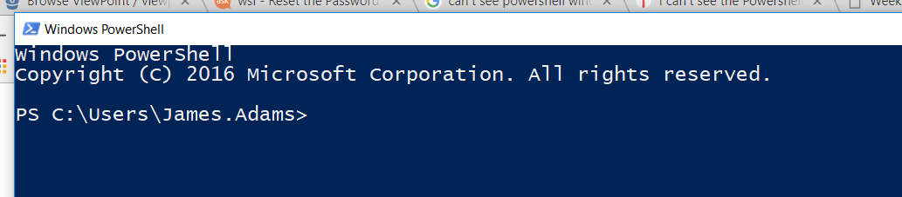
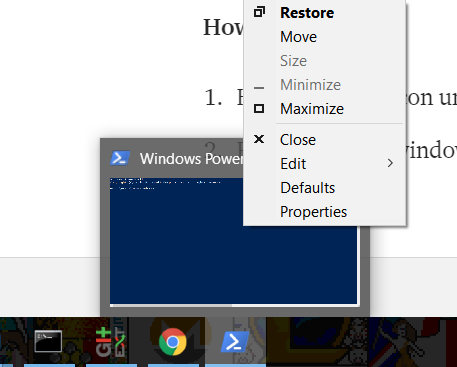
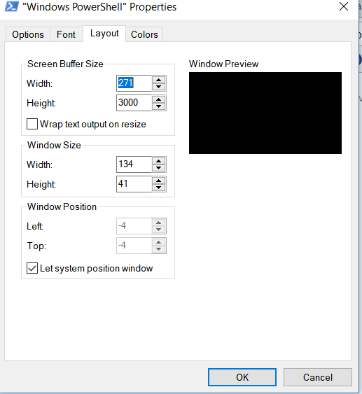

Originally posted [**here**](https://medium.com/@jamesadams0/how-to-fix-your-powershell-window-not-opening-when-you-open-powershell-f14a40c908b) on 08/01/2018 with the title: _How to fix your powershell window not opening when you…open powershell!_.

It's unedited.

---

I’ve been plagued by this annoying issue for a long time.

You’re all ready to hack the world and get something productive done. Full of excitement, trepidation, and maybe lethal quantities of caffeine — you hit the start button, type `powers` (because power alone might open powerpoint) and clearly you have more than one power. Then you hit Enter.

**What you expect**: a powershell window opens, full frontal, and all your emotional, marital, and chiropractic problems are solved.

**What happens**: The powershell icon appears on the taskbar, but even clicking it does nothing. You try everything — nothing seems to bring the damn window into focus.

**How to fix:**

1. Hover over the icon until you see the window itself, only ant-sized.
2. Right click this window, and hit properties.

3. Now, you should see this dialog:

4. Switch to the layout tab, and tick the box that says ‘Let system position window’. Hit ‘OK’.

Now, I can’t quite remember whether you have to restart powershell or whether it works straight away. But if you don’t see your powershell window now or after clicking it in the taskbar — just kill it and open powershell again.

I can’t remember where I read this piece of wisdom, but it was along the lines of — if something takes you more than 2 minutes to type/explain, write a post and put it online. I’m going to start following this from now on. 🎉

Thanks to https://blogs.technet.microsoft.com/heyscriptingguy/2015/11/21/weekend-scripter-the-case-of-the-disappearing-powershell-console/

and

http://www.tomshardware.co.uk/forum/id-3501103/powershell-window.html

for showing me the way.
