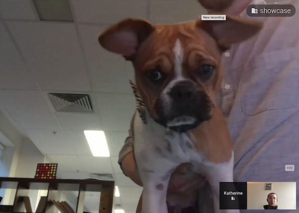
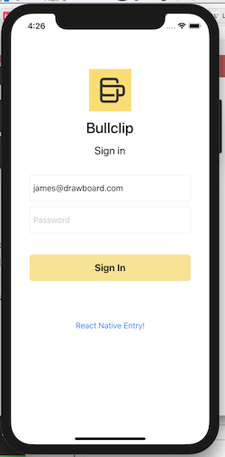
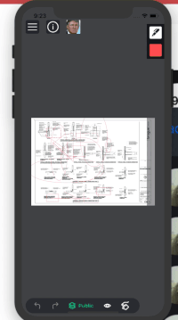

Originally posted [**here**](https://levelup.gitconnected.com/a-one-week-stand-with-react-native-or-how-deep-do-we-plunge-cbb6ca44bb54) on 13/05/2018 with the title: _A one week stand with React Native — Or, how deep do we plunge?_.

It covers my experience shoe-horning react native into an existing iOS app when I was working Drawboard. It's unedited.

---

Our team is huddled around a black wall, littered with cryptic, coloured post-it notes. It seems to have some tabular qualities, but they’re prescriptive rather than restrictive. Some notes have escaped the confines of the masking taped columns. Pictures of people’s disembodied heads have attached themselves to various notes, indicating some sort of possession over the various components of the organised chaos.

By now, you’ve probably guessed it. We’re about to perform the ancient ritual of _stand-up_ . Millions (?) of years of evolution have lead us to this point — and coffee cups in hands, it’s not something to be missed.

This is a how the day starts at Drawboard. A few ‘_good morning_’s are passed around, we hook up a hangout for whoever’s working remotely that day — maybe someone holds up Huey to the camera.

We’re building Bullclip — a collaborative platform for the design and construction industries — and part of the technical challenge is developing across multiple platforms. Currently, we’re on UWP (Universal windows platform), iOS, and Web. As we push toward feature parity across the different platforms, we’re always on the lookout for ways to collaborate and help one another get stuff out the door.

In walks React Native.

I’ve kept a lazy eye on how far RN was coming along over the last year or so, with my only real experience being a half day hackathon at iress, my previous employer. We built a simple financial market data application for mobiles, hooked up to a GraphQL backend. I was pretty impressed how quickly we got it up and running, but I didn’t push the interest in RN any further.

But realising that we have two enthusiastic web devs itching to build cool stuff (myself included), and some heavily requested features to build for iOS — on paper RN seemed enticing.

That afternoon, we got into a room and bashed around a few ideas. 20 minutes later, and I’ve been given some time to explore if React Native would be suitable for our purposes.

Spoiler alert — I’m pretty psyched.

Second spoiler alert — I have 0 experience writing native mobile code. [**Swift**](<https://en.wikipedia.org/wiki/Swift_(programming_language)>) means quick and [**Objective-C**](https://en.wikipedia.org/wiki/List_of_seas) is an impartial Atlantic Ocean — I don’t know either of these programming languages 🤷.

But given sufficient quantities of caffeine, an internet connection and a block of time, I was ready to give this a whirl.

My first course of action was to type into google:

## Integrate react native into existing iOS app

  

And I found [**this**](https://facebook.github.io/react-native/docs/integration-with-existing-apps.html).

I was excited.

Having had no idea whether this was doable or not — mish-mashing RN and native code — it was encouraging to find out it was possible.

So, I start following it. And I’m hitting walls everywhere.

The damn thing won’t compile. We have conflicting Podfile requirements, XCode is yelling at me to step up my game. It can’t find React when I try to import it in Swift — it has no idea what I’m talking about and refuses to take the time to understand my feelings. Yaaaaarg!

A half day’s head bashing condensed into a sentence: I had to use a version other than the latest (`0.51.0` worked for us), and I had to trim the fat from our growing list of dependencies.

The blocker at this point was walking in the dark any time I had to write some native code. Luckily, our iOS engineer was able to unblock me quite a few times. We managed to add buttons in the right places that opened React Native Views. (I personally prefer portals into a magical javascript land where James feels comfortable and safe, but whatever.)

It started with this:

Yes, it’s 4:26am whilst I write this article. 🦉

The next step was to try build a feature that we’ve wanted in our iOS app for a while now, but haven’t had the capacity to prioritise. It’s our timeline/comment feed for talking to other people marking up a drawing.

If we were to build this without insane levels of difficulty, it would mean finding solutions to the following technical concerns:

- Handling authenticated network IO without calling native code
- Full or partial code reuse from our existing web app.
- Performant integration of native components and react views
- Ability to debug. (i.e — have a similar experience to developing on the web)
- Ability to go back and forth easily between native and react views

Spoiler alert: I’ve ascertained that 4 out of 5 are possible, so far.

Once I was in the javascript runtime, my first goal was to see how easy it was to get data from our back end and display it on the screen.

It actually turned out to be pretty easy! The biggest hiccup was when I had to write some swift code to get the bearer token into the JS runtime, but again, our iOS engineer stepped in to unblock me.

Our web app is written 99% in a functional style, so code reuse was 2% copy-paste, 98% webpack/babel config magic. (I wanted [**absolute imports**](https://github.com/react-community/create-react-native-app/issues/171#issuecomment-316994039)). This ticked box number 2. An important caveat is that view logic, because we have `divs` and `spans` everywhere, is not shareable at this point. This is fine for now, but we’ll probably have some hurdles to solve down the line if we’re super keen on the whole ‘write once’ idea. Think [**react-native-web**](https://github.com/necolas/react-native-web).

And now we get to debugging. Yes, web-esque hot reloading debugging sorcery is doable! Out of the box too! [**React Native Debugger**](https://github.com/jhen0409/react-native-debugger)

You just have to flick a few switches and you’re in the game. It’s incredible.

  

**With the build tooling in check, it was time to write a feature.**

  

Of course, I had to make sure users knew what the feature was — so they’d click the button of course.

Spot the odd one out. Click it.

This is another ‘portal’ into a react native view. It opens a very basic, bug-riddled timeline, but it’s a successful proof of concept showing that we can indeed build small features in react native at this point.

The biggest blocker here was telling the native runtime that I wanted to hide the react native view, from javascript.

I originally achieved this using the [**NotificationCenter**](https://developer.apple.com/documentation/foundation/notificationcenter) — since there wasn’t any clean navigation stack to pop on and off to.

But basically I exposed a swift function to javascript by following [**this**](https://facebook.github.io/react-native/docs/native-modules-ios.html#exporting-swift).

I don’t think we’re ready to dive in the deep end and do a complete re-write. Nor do I think that would be smart. But right now, building out small, isolated features in react native makes perfect sense for us. The web platform is further along than iOS or Windows, so there’s no issue of lagging behind if we step off the gas on the Web front.

A few things I’m yet to tackle include:

- Different screen sizes.
- Deployment
- Performance characteristics

But I don’t foresee any crazy roadblocks.
